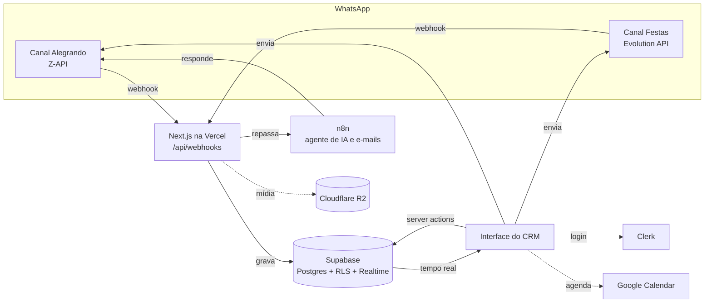

<div align="center">

# CRM Alegrando

**CRM sob medida para uma agência de turismo pedagógico, com WhatsApp, e-mail, agenda e atendimento por IA no mesmo lugar.**


</div>

---

## Sobre

A [Alegrando Eventos](https://alegrando.com.br) organiza excursões escolares e festas. O atendimento acontecia em dois números de WhatsApp, planilhas e e-mail, sem histórico único por cliente e sem forma de saber quando a IA estava respondendo ou quando uma pessoa precisava assumir.

Este CRM junta tudo numa tela só:

- as conversas dos dois canais de WhatsApp chegam em tempo real;
- cada lead tem histórico, etapa no funil, tarefas e agendamentos;
- a equipe liga e desliga a IA por conversa, sem conflito entre o atendimento automático e o humano.

O sistema está em produção e é usado pela equipe comercial da Alegrando no dia a dia.

## Funcionalidades

| Área | O que faz |
|---|---|
| **Conversas** | Chat do WhatsApp em tempo real nos dois canais: texto, áudio (gravação e player), imagem, documento, reações, edição de mensagem e respostas rápidas com `/` |
| **Atendimento por IA** | Mensagens repassadas a um agente no n8n, com pausa da IA por conversa para a equipe assumir |
| **Kanban** | Funil de vendas com arrastar e soltar, etiquetas com cor livre e filtros |
| **Leads** | Cadastro, histórico completo e dados de cada escola ou cliente |
| **Agenda** | Agendamentos sincronizados com o Google Calendar |
| **E-mails** | Envio em lote com anexos, agendamento e acompanhamento das respostas |
| **Tarefas** | Quadro da equipe com listas, cartões e responsáveis |
| **Base de passeios** | Catálogo de passeios com embeddings, consultado pelo agente de IA |
| **Follow-up** | Rotina diária que dispara os retornos programados |
| **Dashboard** | Visão geral do funil e do atendimento |

## Arquitetura



## Decisões técnicas

- **Webhooks autenticados.** Cada webhook confere o segredo do provedor com comparação de tempo constante. Não existe interruptor para desligar essa verificação.
- **Idempotência na entrada de mensagens.** Um índice único em `(messageId, canal)` impede mensagem duplicada no banco. Reentregas do provedor não são repassadas ao agente, para a IA não responder duas vezes.
- **Nenhuma mensagem perdida em silêncio.** Se a gravação falha, o webhook responde erro e o provedor reenvia.
- **Dados pessoais fora dos logs.** Telefones aparecem mascarados (`***1234`), URLs de mídia só pelo domínio e credenciais nunca em claro.
- **Autorização no middleware.** Além do login no Clerk, o acesso é limitado a uma lista de e-mails da equipe e conferido no servidor, não só no layout.

## Stack

- **Frontend:** Next.js 16 (App Router), React 19, TypeScript, Tailwind CSS, shadcn/ui, dnd-kit, FullCalendar
- **Backend:** Server Actions e Route Handlers do Next.js, Zod
- **Banco:** Supabase (Postgres, Row Level Security, Realtime)
- **Autenticação:** Clerk
- **Integrações:** Z-API, Evolution API, n8n, Google Calendar e Drive, Cloudflare R2, OpenAI (embeddings)
- **Infraestrutura:** Vercel (região `gru1`, São Paulo)

## Estrutura

```
src/
├── app/
│   ├── (app)/            # telas autenticadas: conversas, kanban, leads, agenda...
│   ├── (auth)/           # login
│   └── api/              # webhooks, cron de follow-up, anexos
├── components/           # componentes de interface
├── proxy.ts              # autenticação e allowlist de cada requisição
└── lib/
    ├── actions/          # server actions por domínio
    ├── whatsapp/         # envio e mídia (Z-API e Evolution)
    ├── google/           # Calendar e Drive
    └── ...
supabase/migrations/      # migrations SQL em ordem de aplicação
scripts/                  # backfills e utilitários de manutenção
docs/                     # PRD, especificação e auditorias
```

## Rodando localmente

Pré-requisitos: Node.js 22+, um projeto Supabase e uma aplicação Clerk.

```bash
git clone https://github.com/GMedeiros-cyber/CRM-Alegrando.git
cd CRM-Alegrando
npm ci
cp .env.example .env.local   # preencha as variáveis
npm run dev
```

Aplique as migrations de `supabase/migrations/` no seu projeto Supabase, na ordem dos nomes.

## Testes

```bash
npm test          # testes unitários (node:test)
npx tsc --noEmit  # checagem de tipos
npm run e2e       # screenshots e responsividade (Playwright)
```

## Autor

Desenvolvido por **Gabriel** · [@GMedeiros-cyber](https://github.com/GMedeiros-cyber)

Projeto feito para a Alegrando Eventos. O código está publicado como portfólio. Todos os direitos reservados.
